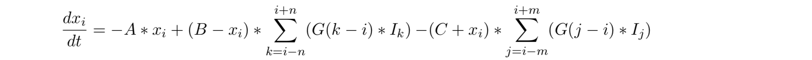

# Discrete Neural Simulation for Asynchronous Processing Structures

## Motivation
Neural network simulations are mostly done by layer, propagating information through vectorized operations. All neurons in the same layer receive their information at the same time. In a network with receptive fields, this means all the information for the convolution is ready, but in a biological system, this just isn’t the case.
## Proposition
I propose a study of a de-synchronized receptive field network. For each neuron in a layer, the information from the previous may or may not be available. To perform this computation, a uniform-sampling discrete simulation is needed, for, given set distances of each synaptic connection and a global time constant, each discrete step of the simulation will update the network on an event occurring, such as data reaching the end of the axon, presentation of a stimulus, etc…
## Implementation
I suggest we use a simple on-center/off-surround shunting model:

Using this model, which is commonly used in vectorized computation, we can apply it neuron by neuron. We initialize a zeroed 1 layer network of 100 neurons. We choose a random number between 10mm and 20mm for each neuron to represent the axon length from the stimulus to the neuron. In this simulation, we will use a time constant of 10ms, meaning a neuron will hold a value for 10ms in simulation, given biological time constants of less than 10 milliseconds. The values will propagate through the axons at a distance of 1m/s (non-myelinated axons). There will be two types of events the drive the simulation: STIM events and SYNAP events representing stimulus sampling and data propagation terminating respectively.
## Other notes
Discrete event simulation is extremely powerful because of its abstraction of time. Time is just a value attached to an event that determines event calculation order, such that a real time engine can be later built on top of the event engine with a temporal simulation. Furthermore, this type of neural modeling already exists, but the goal here is to build an intermediate form that would be applicable to artificial neural networks. It would be possible, given good performance of the system, to translate the model into relational equation that would remove the need for events, which is only be used here for ease of analysis and proof of concept.
